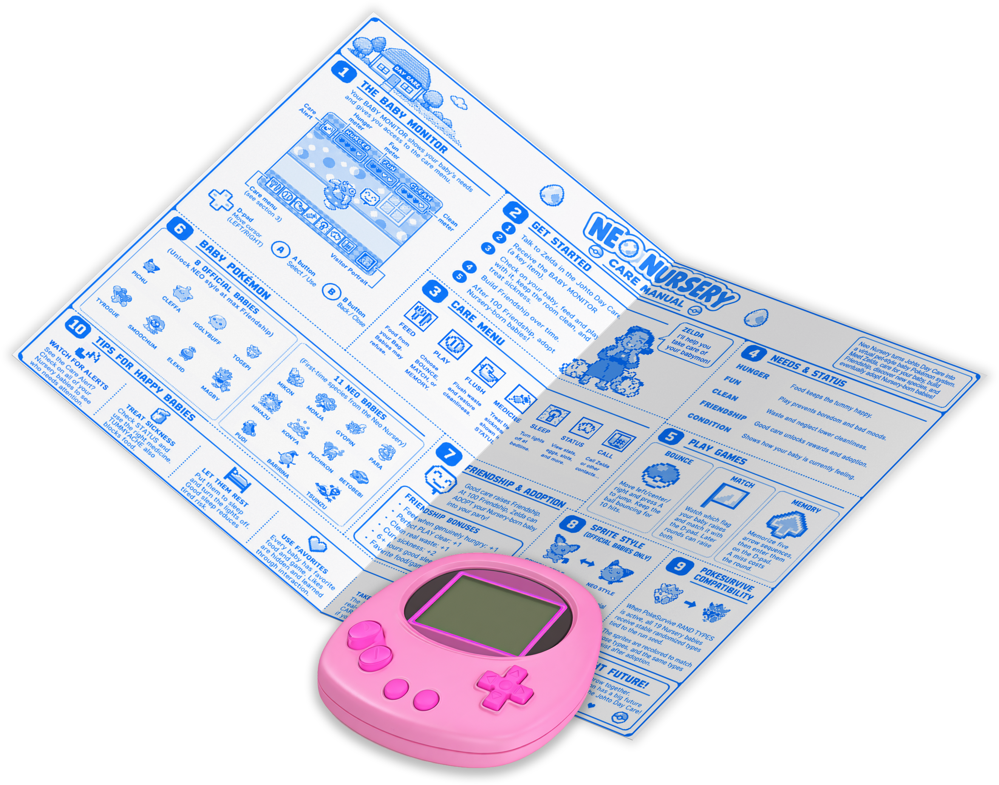

  

# Neo Nursery

A Pokémon Crystal mod for **gen1recomp** that turns the Johto Day Care into a virtual pet-style Baby Pokémon nursery.

Meet **Zelda** at the Day Care, receive the **BABY MONITOR**, choose an Egg, and raise a Baby Pokémon through feeding, play, cleaning, sleep, illness, Friendship, and adoption. Neo Nursery supports Crystal's eight official Baby Pokémon plus eleven reconstructed cut babies that can be discovered through long-term Nursery progression.

## Install

1. Use **gen1recomp 0.3.8 or newer** with a legally obtained Pokémon Crystal (USA/Europe Rev 1) ROM.
2. Install the Neo Nursery release ZIP through the launcher or place it in the launcher's mods folder.
3. Enable Neo Nursery for Pokémon Crystal.
4. Visit the Johto Day Care and speak with **Zelda**.

Neo Nursery does **not** include a Pokémon Crystal ROM or ROM-extracted official Pokémon sprite files.

## Getting started

   
  Download the care manual

Zelda introduces the Nursery and gives you the **BABY MONITOR**, a real Key Item that can also be registered to **SELECT** for quick access.

Your first visit is guided: Zelda walks you through **STATUS -> NEW EGG** and explains the basic care loop. Nursery-generated Eggs hatch after about **10 minutes** on the compatible Crystal/PokeSurvive clock, and a new Nursery Egg can normally be claimed once every **24 real hours**.

The Nursery has **three persistent resident slots**. Eggs and babies continue to track their own state independently, including while another resident is selected.

## Care system

Each baby has three visible care meters:

- **HUNGER** — restored with compatible food and drink items from your real PACK.
- **FUN** — restored through PLAY.
- **CLEAN** — affected by waste and restored by flushing the Nursery.

New hatchlings begin at **2 FOOD / 2 FUN / 4 CLEAN**.

Care advances using real elapsed time. Hunger and Fun fall gradually while a baby is awake, sleep dramatically slows need drain, digestion progresses in the background, and neglected waste can continue lowering CLEAN. **PAUSE CARE** freezes Nursery care time when you need to step away.

Babies also track persistent **Friendship**, **age**, **weight**, sleep state, food/game preferences, digestion, sickness risk, and individual care history.

## PLAY minigames

PLAY contains three Nursery minigames:

- **BOUNCE** — move left, center, and right to bounce a falling Poké Ball through ten rounds.
- **MATCH** — react to the baby's raised flag and match its direction.
- **MEMORY** — watch and repeat increasingly long D-pad sequences.

Good play restores FUN and can build Friendship when the baby actually needs entertainment. Repeatedly farming games at full FUN does not provide unlimited Friendship.

## COND and thought bubbles

STATUS includes **COND**, a living condition readout rather than a simple sickness field.

Urgent conditions such as **HUNGRY**, **DIRTY**, **BORED**, or a medical illness appear immediately. Healthy babies can also settle into slower flavor conditions such as **PLAYFUL**, **LOVED**, **SATIATED**, **FRESH**, **CURIOUS**, **DAYDREAMING**, **ENERGETIC**, **GRACEFUL**, or **RELAXED**.

Thought bubbles reinforce those states and react to care, favorite foods, favorite games, illness, sleep, wins, losses, and other moments. Flavor CONDs change slowly rather than constantly, making them something to discover when checking in.

Medical conditions include **TUMMYACHE, TIRED, RASH, FEVERISH,** and **SAPPED**. Zelda can give clues about which medicine to try, and FULL HEAL works as a universal treatment.

## Sleep, digestion, and cleanliness

Babies follow species-adjusted sleep schedules. Turning the Nursery lights off during bedtime provides proper rest; leaving them on results in worse sleep quality.

Food also feeds a hidden digestion system. When digestion fills, a baby may eventually leave waste in the Nursery. Waste immediately hurts CLEAN and becomes more harmful if left sitting around. Use **FLUSH** to clear it.

## Friendship, adoption, and evolution

Raise a Nursery-born baby to **100 Friendship** and Zelda will allow it to be adopted into your party, or sent to PC storage if the party is full.

Neo Nursery's visible Friendship synchronizes with Crystal's real hidden happiness value. At 100 Nursery Friendship, happiness reaches 255.

That means happiness-evolution babies are ready to evolve on a qualifying level-up after adoption unless they are holding an **EVERSTONE**. Zelda gives one Everstone the first time you reach a full-Friendship milestone.

Adopted or withdrawn Baby Pokémon may be dropped back off later. Their **Friendship, weight, Sprite Style, shiny state, randomized identity, and Pokémon record** remain attached to the Pokémon. FOOD/FUN/CLEAN are care values for the current Nursery stay, so a returning baby starts its new stay at **2 / 2 / 4** rather than using withdrawal to refill every meter for free.

## 19 supported babies

Crystal's official Baby Pokémon:

**Pichu, Cleffa, Igglybuff, Togepi, Tyrogue, Smoochum, Elekid, Magby**

Neo Nursery also adds eleven reconstructed cut babies:

| Neo Baby | Evolves into |
| --- | --- |
| Mikon | Vulpix |
| Monja | Tangela |
| Gyopin | Goldeen |
| Para | Paras |
| Hinazu | Doduo |
| Konya | Meowth |
| Puchikon | Ponyta |
| Betobebi | Grimer |
| Pudi | Growlithe |
| Baririna | Mr. Mime |
| Tsuinzu | Girafarig |

The reconstructed babies are Nursery-exclusive species. They do not enter normal wild, Trainer, rental, or procedural species pools.

Reaching 100 Friendship with a species for the first time unlocks one random still-undiscovered Neo Baby Egg. There are no duplicate unlocks, and discovered Neo Eggs permanently join your Nursery choices.

Nursery-generated Eggs have a **1-in-20 shiny chance**.

## CRYSTAL and NEO Sprite Styles

Official babies hatch using their released **CRYSTAL** presentation. Once you master that species at full Friendship, **NEO** Sprite Style becomes available in STATUS.

CRYSTAL presentation uses the player's imported Crystal data at runtime, including additional native animation poses during feeding and idle flourishes. Neo Nursery does not ship extracted official Pokémon sprite PNGs.

The selected style follows the individual Pokémon through adoption, Summary screens, battles, and later Nursery visits.

## Zelda and the CALL system

Zelda is more than the onboarding NPC. The Nursery's **CALL** feature can bring up her portrait for contextual help.

She can explain newly encountered care mechanics, give medicine clues, comment on current COND, talk about age/weight/preferences/Friendship, and react to important milestones. Automatic lessons are one-time tutorials, while manual calls can still repeat useful urgent-care advice.

## Saving and persistence

Neo Nursery stores its persistent state in the normal save system.

Real elapsed time is reconstructed from saved timestamps, but care actions made **after your most recent game SAVE** can still roll back if you quit without saving. Save normally after important Nursery actions just as you would after other Pokémon Crystal progress.

## PokeSurvive compatibility

Neo Nursery supports [PokeSurvive](https://github.com/GawdMode/PokeSurvive).

When enabled:

- **RAND TYPES** gives official and reconstructed babies stable seeded typings and matching palettes.
- Reconstructed babies inherit the randomized typing of the family they evolve into.
- **RAND STATS** gives cut babies deterministic randomized stat spreads while keeping them sensible pre-evolutions of their target family.
- **RAND MOVES** gives them seeded, type-aware learnsets and TM/HM compatibility.
- The randomized identity persists through save/reload, CRYSTAL/NEO style changes, adoption, re-dropoff, Summary, battle, and evolution.

PokeSurvive camping can advance compatible in-game Egg timing without falsely applying the same number of hours as real-world care neglect.

## Attribution

Custom Pokémon sprite artwork: **Rool, Smalls, Pik, Bencc, Nuuk, Scarlax, Sam the Salmon, and SoupPotato (SourApple / BlazingMagmar)** from [Pokémon Gold & Silver ’97: Reforged](https://www.pokecommunity.com/threads/pok%C3%A9mon-gold-and-silver-97-reforged-complete.437360/). Item icon artwork: **NESS** via [The Spriters Resource](https://www.spriters-resource.com/).

Bug reports and unusual mod combinations are welcome. If reporting a compatibility issue, please include your gen1recomp version, enabled mods, relevant randomizer settings, and reproduction steps.
